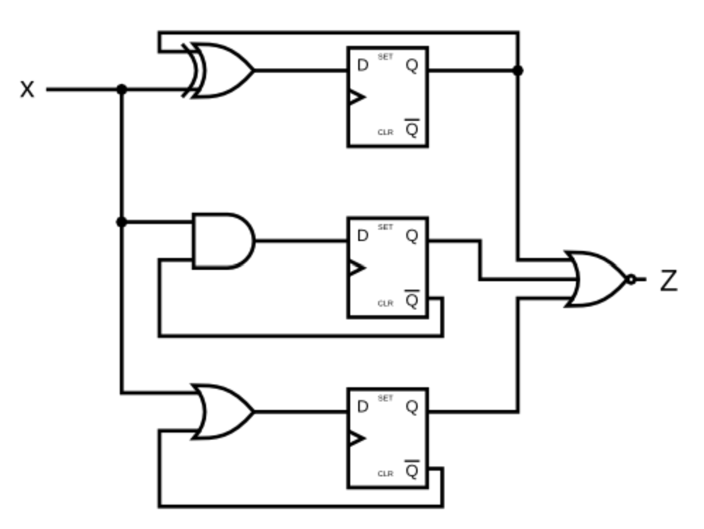

# FSM Implementation

Construct the Finite State Machine as depicted in the provided diagram.


*Source: https://hdlbits.01xz.net/wiki/Exams/ece241_2014_q4*

**Verilog Module Declaration:**
```verilog
module DFF(
    input clk,
    input reset,
    input d,
    output reg q,
    output q_bar
);

assign q_bar = ~q;

always @(posedge clk) begin
    if (reset) begin
        q <= 1'b0;
    end else begin
        q <= d;
    end
end


module fsm_circuit(
    input wire clk,    // Clock input
    input wire reset,  // Asynchronous reset input
    input wire x,      // Input 'X'
    output wire z      // Output 'Z'
);
// Internal logic and DFF instances will be defined here.

endmodule
```

