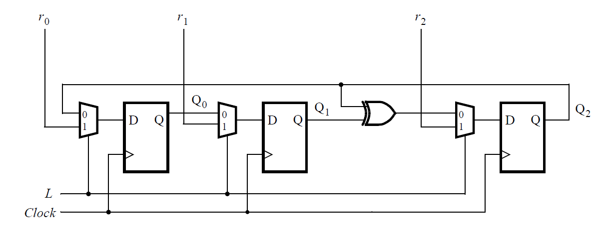

## Synchronous 3-Bit Shift Register Implementation

Design a Verilog module for a 3-bit synchronous shift register as shown in the provided figure. The register should feature individual load controls (`r0`, `r1`, `r2`) for each bit, allowing either the retention of the current bit or loading from the input `L` on a clock edge. Implement the shift register to reset asynchronously, setting all bits to `0` upon activation of a reset signal. Validate the design with a testbench that demonstrates both the shifting and parallel loading functionalities.


<p>Source: <a href="https://hdlbits.01xz.net/wiki/Mt2015_lfsr">HDLBits</a></p>

**Verilog Module Declaration:**
```verilog
module shift_register(
    input wire clk,
    input wire rst,
    input wire L,        // Parallel load input
    input wire r0,       // Load/shift control for Q0
    input wire r1,       // Load/shift control for Q1
    input wire r2,       // Load/shift control for Q2
    output reg Q0,
    output reg Q1,
    output reg Q2
);
```


